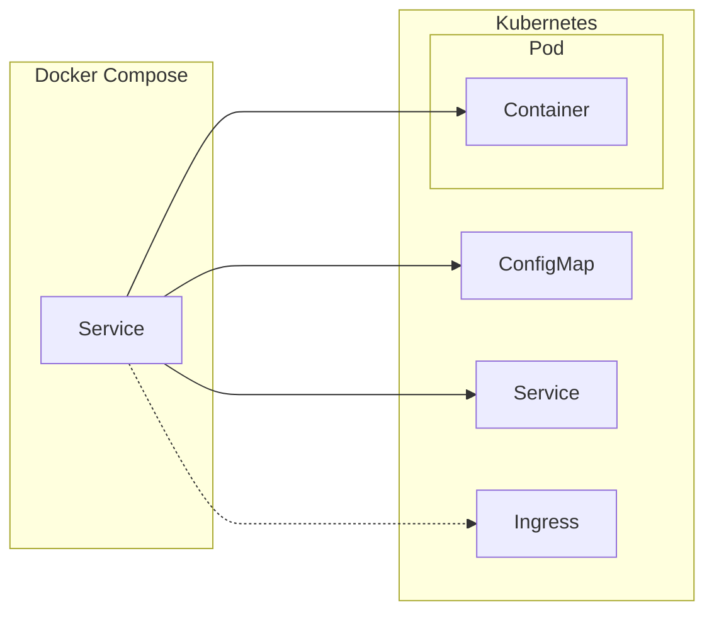

The architecture of how Komposer translates the Docker Compose file into a Kubernetes manifest is very simple and intuitive.

For each service defined in the Docker Compose file, Komposer generates a Kubernetes manifest with:

- a unique Kubernetes ConfigMap for each unique set of `environment` or `env_file` keys in the Docker Compose file
- a single Kubernetes Pod with one container for each Docker compose service
- a Kubernetes Service for each Docker Compose service pointint to the relative container in the Kubernetes Pod
- when using the `--ingress-for-service` CLI argument, a Kubernetes Ingress pointing to a Kubernetes Service

Below a diagram or the translation's architecture.

This is applied to all the services in the Docker Compose file except that only one Kubernetes Ingress can be created for only one Docker Compose service.

During the translation Komposer substitute the `KOMPOSER_*` environment variables before render the Kubernetes manifest; see the [Environment Variables](../usage/env_variables.md) section for the whole list of available variables.
